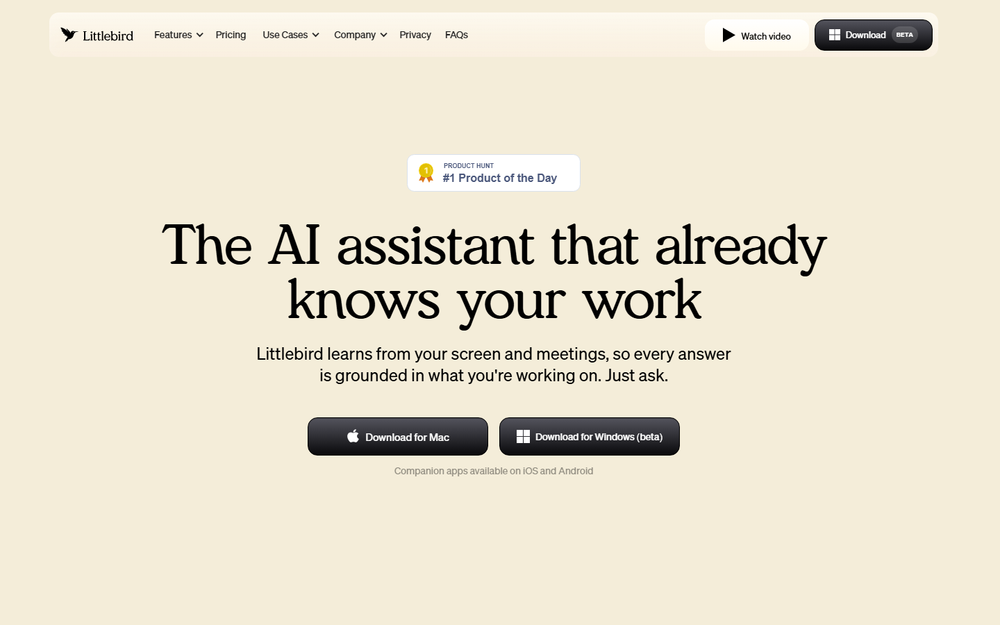
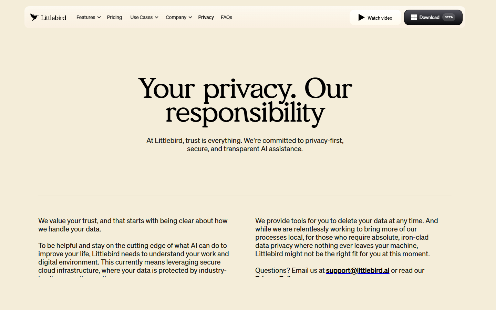
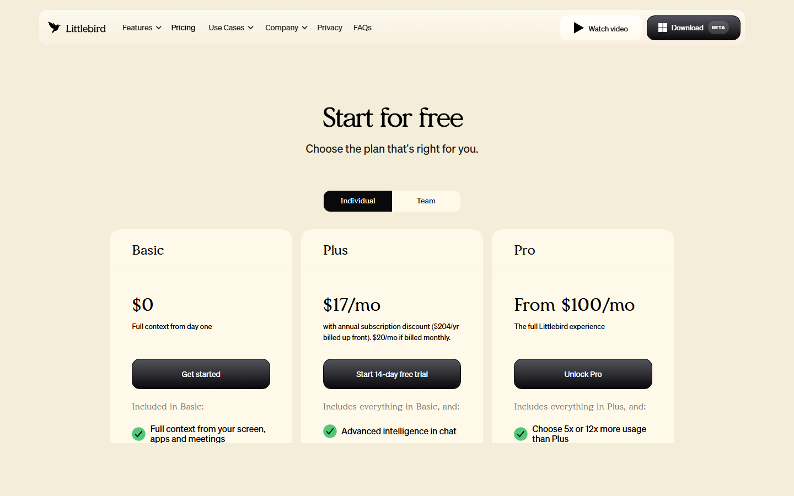
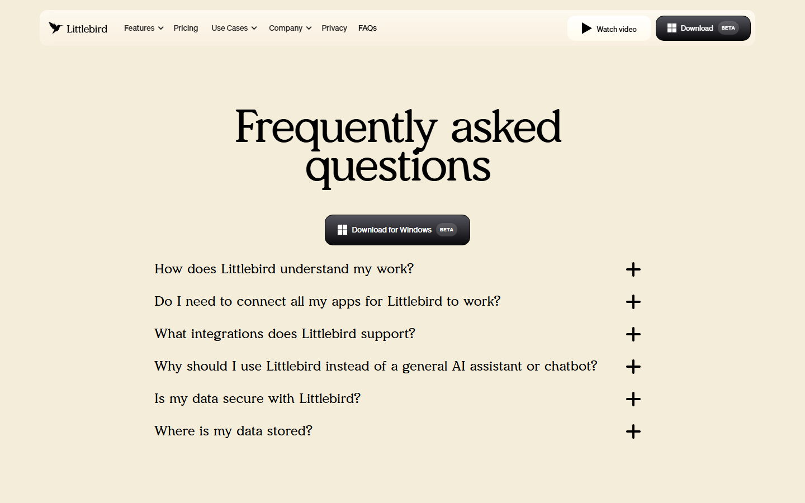
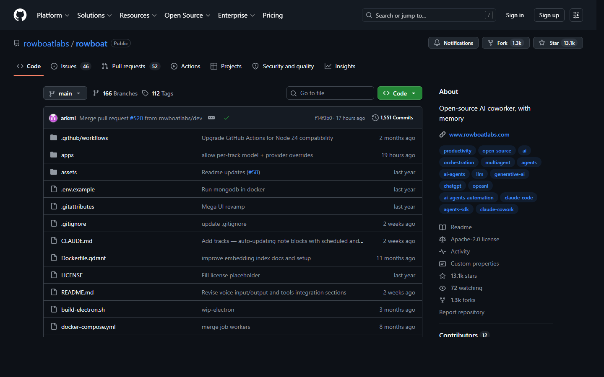
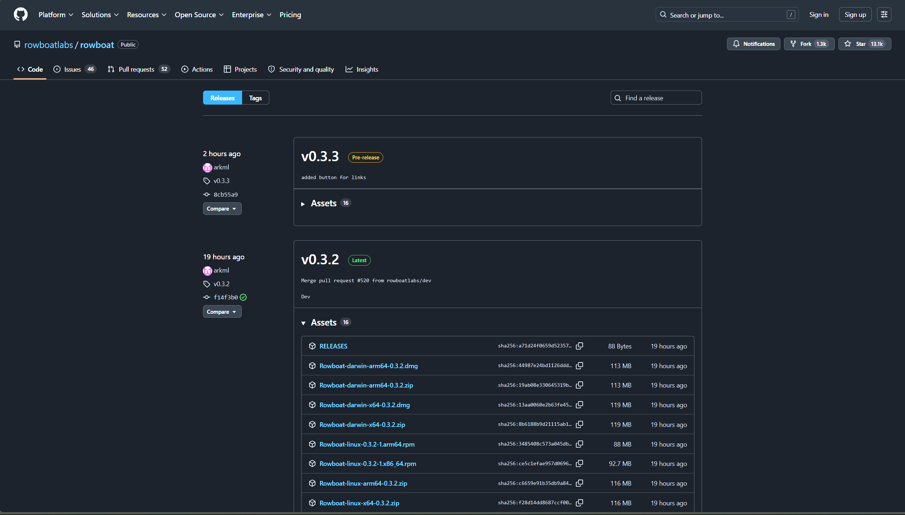
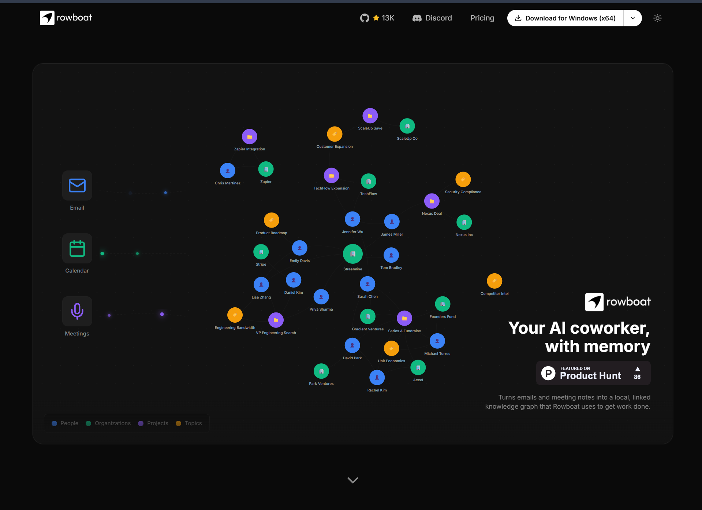
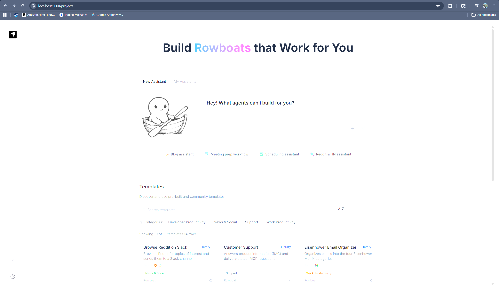
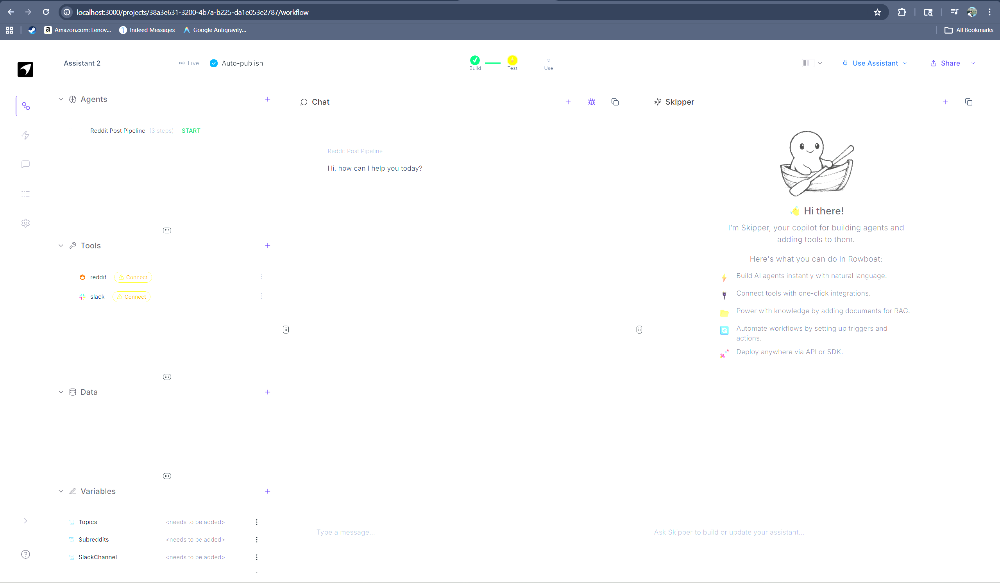
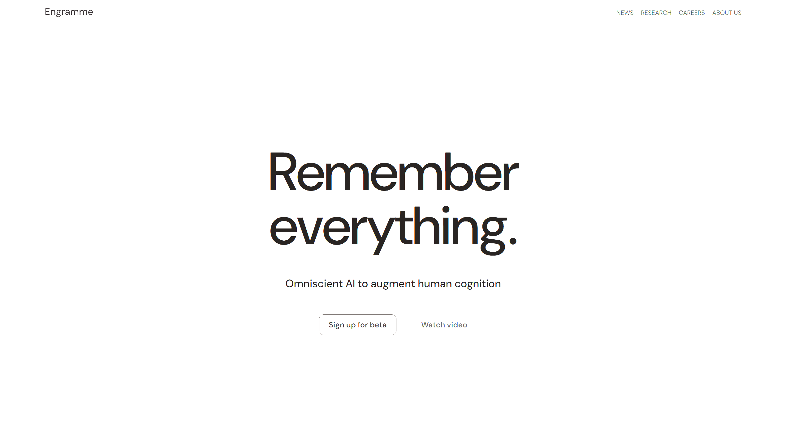

# AI Tool Evaluation Report
**Date:** April 25, 2026

**Evaluator:** Subburi Dheeraj Varma

**Method:** Live hands-on testing + screenshot evidence

**Platform:** Windows 11 (no Mac available - see instructor note)

---

## Important Note on Platform

Littlebird AI's primary platform is **macOS**. The Windows version is labelled **"beta"** on their homepage. As this evaluation was conducted on Windows 11, full Littlebird installation testing was not possible. All Littlebird findings are based on:
- Live website review and screenshots
- Official privacy documentation
- Help centre and FAQ pages
- Product Hunt reviews

This limitation is itself a usability finding: **Littlebird is not production-ready on Windows.**

---

## PHASE 1 - LITTLEBIRD AI

### Screenshot 1 - Homepage

**Observation:** Homepage confirms dual-platform availability - "Download for Mac" (primary) and "Download for Windows (beta)". Product Hunt #1 Product of the Day badge visible. Windows users are treated as second-class - the beta label signals the product is not fully ready on this platform.

---

### Screenshot 2 - Privacy Page

**Observation:** Littlebird's own privacy page contains this admission:
> *"for those who require absolute, iron-clad data privacy where nothing ever leaves your machine, Littlebird might not be the right fit for you at this moment."*

This is a **self-disclosed cloud dependency** - the strongest possible evidence against it for privacy-sensitive use cases.

---

### Screenshot 3 - Pricing

**Observation:** Three tiers: Basic ($0), Plus ($17/mo), Pro ($100+/mo). Even the free tier collects "full context from your screen, apps and meetings" - meaning cloud data collection begins immediately, even at no cost.

---

### Screenshot 4 - FAQ

**Observation:** FAQ includes "Where is my data stored?" - confirming this is a common user concern. "Download for Windows BETA" button in header confirms beta status.

---

### Findings

| Field | Detail |
|---|---|
| **Permissions** | macOS Accessibility (reads active window text); Microphone (meeting transcription) |
| **Data handling** | Cloud-mandatory. AES-256 + TLS 1.3. Hosted on AWS US East. No model training on user data |
| **Platforms** | Mac (primary), Windows (beta), iOS, Android |
| **Key risk** | All data leaves the device - self-disclosed on privacy page |
| **Compliance** | SOC 2, GDPR, CCPA, HIPAA |
| **Installation on Windows** | Not completed - Windows version is beta, Mac required for full experience |

### Verdict
Easy to use but cloud-mandatory by design. The Windows beta status meant full installation testing was not possible on this machine. Privacy page self-discloses data leaves device - disqualifying for high-sensitivity environments.

---

## PHASE 2 - ROWBOAT

### Screenshot 5 - GitHub Repository

**Observation:** `rowboatlabs/rowboat` - 13.1k stars, 1.3k forks, Apache-2.0 license. Last commit was 17 hours before evaluation. Tags: open-source, ai, multiagent, agents. Actively maintained with YC S24 backing.

---

### Screenshot 6 - Latest Release

**Observation:** v0.3.2 released the day before evaluation (April 24, 2026). 16 release assets covering Windows, macOS, and Linux. Extremely active release cadence.

---

### Screenshot 7 - Official Download Page

**Observation:** Official website shows "Download for Windows (x64)" - confirming stable Windows support, unlike Littlebird which remains in beta on Windows.

---

### Screenshot 8 - Running UI: Home Page (Docker + Ollama, no API key)

**Observation:** Rowboat home page running locally at localhost:3000. Shows the "Build Rowboats that Work for You" interface with the Skipper copilot prompt box and 10 pre-built templates (Customer Support, Meeting Prep, GitHub PR to Slack, Tweet Assistant, etc.). No paid API key used - powered by local Ollama llama3.1.

---

### Screenshot 9 - Running UI: Project Builder

**Observation:** Inside a Rowboat project - the full multi-agent builder showing the Agents, Tools, Data, and Variables panels on the left, Chat in the centre, and Skipper copilot on the right. Confirms the tool is fully functional and running locally on Windows.

---

### Installation Evidence (Terminal)

**Step 1 - Clone repository:**
```
git clone https://github.com/rowboatlabs/rowboat.git
✓ Successfully cloned
```

**Step 2 - Download Windows binary (v0.3.2):**
```
curl -L Rowboat-win32-x64-0.3.2.zip  →  138MB downloaded
unzip  →  rowboat.exe extracted (202MB Electron app, v39.2.7)
```

**Step 3 - Configure for free local use (no API key):**
```
PROVIDER_BASE_URL=http://host.docker.internal:11434/v1  (Ollama)
PROVIDER_DEFAULT_MODEL=llama3.1:latest
docker-compose up --build -d
✓ All 4 containers running (rowboat, jobs-worker, mongo, redis)
✓ HTTP 200 confirmed at http://localhost:3000
```

**Known limitation discovered:** The AI copilot ("Skipper") does not work well with smaller local models like llama3.1. It requires a capable model (GPT-4, Claude) to reliably interpret build instructions. This reintroduces cloud dependency for the copilot feature specifically.

### Findings

| Field | Detail |
|---|---|
| **Setup result** | Successfully running via Docker + Ollama on Windows |
| **Architecture** | Local-first - all data stored as Markdown in `~/.rowboat/` |
| **Privacy** | Strongest of three - air-gap possible with local LLM |
| **Transparency** | Apache 2.0 open source - fully auditable |
| **Usability** | Technical barrier: Docker + Ollama setup required |
| **Cost** | Free (open source). API costs apply only for optional cloud features |
| **Copilot limitation** | Skipper requires strong LLM - broken with free local models |

### Verdict
Strongest privacy posture. Successfully installed and running on Windows. Setup requires Docker and Ollama - not suitable for non-technical users without guidance. Copilot feature requires paid LLM to work well.

---

## PHASE 3 - ENGRAMME

### Screenshot 10 - Homepage

**Observation:** Clean, minimal design. Headline: "Remember everything." Tagline: "Omniscient AI to augment human cognition." The only two actions available are "Sign up for beta" and "Watch video." No product download, no login, no feature list. Navigation links (News, Research, Careers, About Us) confirm this is a company website, not a product page.

---

### Findings

| Field | Detail |
|---|---|
| **Availability** | Not publicly available - waitlist only |
| **Product status** | Pre-product / research phase |
| **Company** | Founded 2025, Gabriel Kreiman (Harvard neuroscientist) + Spandan Madan |
| **Funding** | $3M pre-seed (Mayfield Fund), seeking $100M at ~$1B valuation |
| **Research** | Published in *Nature Human Behaviour* and *Scientific Reports* |
| **Privacy** | Unknown - no product to evaluate |

### Verdict
Cannot be evaluated as a functional tool. Scientifically credible team but no product exists. Revisit in 12-18 months.

---

## PHASE 4 - COMPARISON TABLE

| Factor | Littlebird AI | Rowboat | Engramme |
|---|---|---|---|
| **Available** | Mac yes / Win beta | Yes (all platforms) | No (waitlist) |
| **Privacy** | Medium | High | Unknown |
| **Usability** | Easy (no setup) | Hard (Docker + config) | N/A |
| **Transparency** | Low (closed source) | High (Apache 2.0) | Low (no product) |
| **Data storage** | Cloud mandatory (AWS) | Local-first (Markdown) | Unknown |
| **Air-gap possible** | No | Yes (with Ollama) | N/A |
| **Cost** | $0–$100+/month | Free | N/A |
| **Compliance certs** | SOC 2, GDPR, CCPA, HIPAA | None (open source) | None |
| **Windows support** | Beta only | Stable | None |
| **Free without API key** | Yes (but cloud) | Yes (with Ollama) | N/A |
| **Copilot/AI works free** | Yes | Partial (weak with local LLM) | N/A |

---

## PHASE 5 - FINAL RECOMMENDATION

### Primary: Rowboat
For privacy-sensitive users and technical teams.

1. Local-first - data stays on your machine as plain Markdown
2. Air-gappable - runs fully offline with Ollama
3. Open source - anyone can audit the code
4. Cross-platform - stable on Windows, Mac, Linux
5. Free - no subscription required

**Caveat:** Requires Docker, Ollama, and some technical setup. Copilot feature needs a capable LLM to work well.

---

### Secondary: Littlebird AI
For non-technical users where ease-of-use outweighs privacy concerns.

1. Zero setup - download and run (on Mac)
2. SOC 2, HIPAA compliant
3. Free tier available
4. Polished, intuitive UI

**Caveat:** Windows version is beta. All data goes to AWS cloud. Not suitable for sensitive data.

---

### Not Evaluated: Engramme
No product available. Revisit when public beta launches.

---

## SUMMARY

| Criterion | Winner |
|---|---|
| Privacy | **Rowboat** |
| Usability | **Littlebird** |
| Windows support | **Rowboat** |
| Transparency | **Rowboat** |
| Cost (free tier) | **Tie** |
| Compliance certs | **Littlebird** |

**Recommended tool: Rowboat** - for its local-first architecture, open-source transparency, and full Windows support with no paid API key required.

---

*Sources:*
- [littlebird.ai](https://littlebird.ai) - [privacy](https://littlebird.ai/privacy) - [pricing](https://littlebird.ai/pricing) - [faq](https://littlebird.ai/faq)
- [support.littlebird.ai/article/privacy-security](https://support.littlebird.ai/article/privacy-security)
- [github.com/rowboatlabs/rowboat](https://github.com/rowboatlabs/rowboat)
- [rowboatlabs.com/downloads](https://www.rowboatlabs.com/downloads)
- [engramme.com](https://www.engramme.com)
- [producthunt.com/products/littlebird](https://www.producthunt.com/products/littlebird)
- [news.ycombinator.com/item?id=43763967](https://news.ycombinator.com/item?id=43763967)
